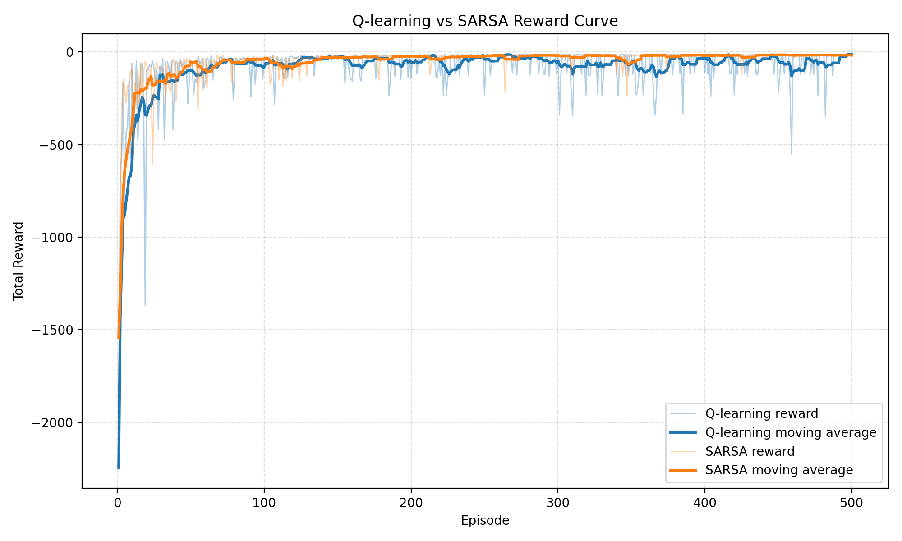
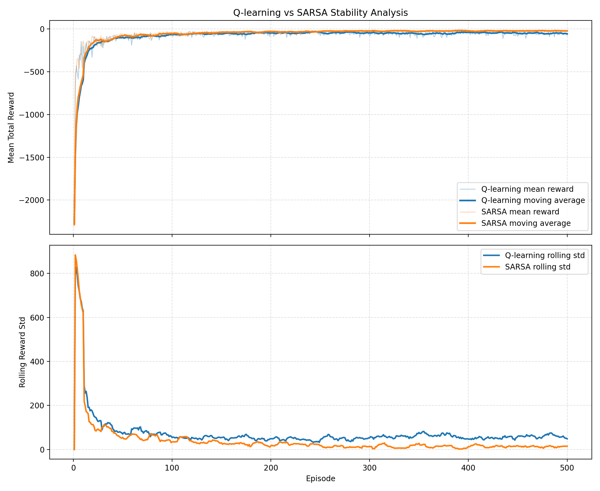
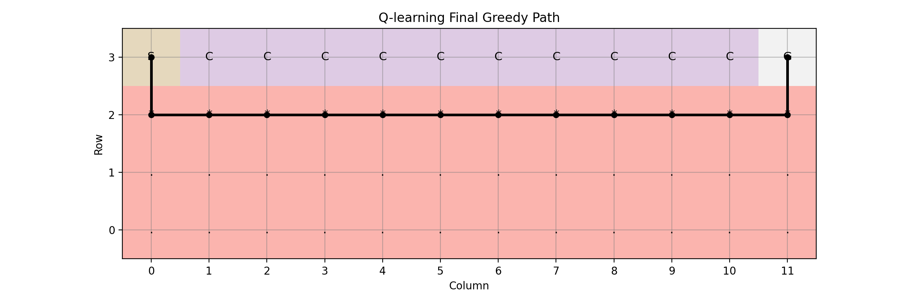
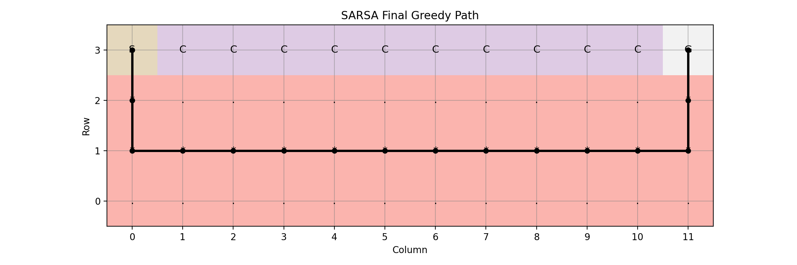
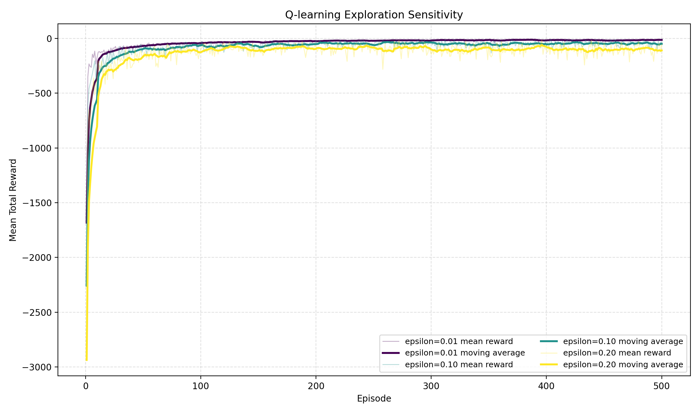
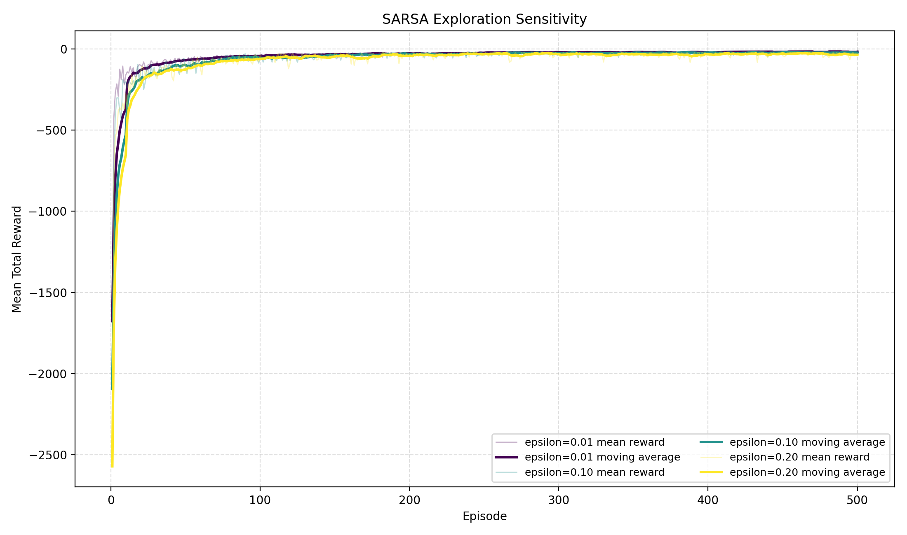
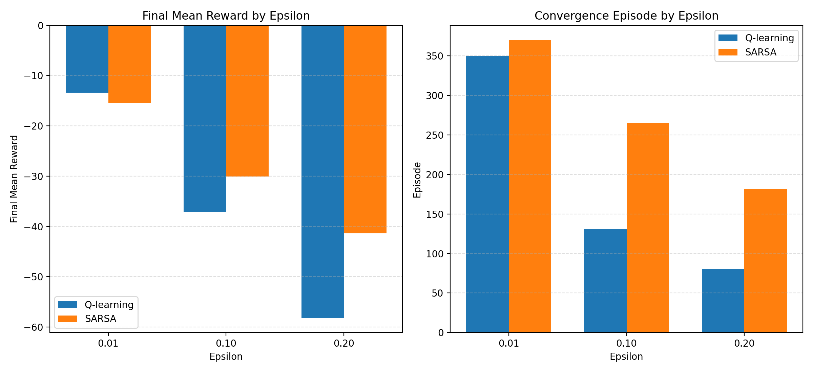

# Q-learning 與 SARSA 在 Cliff Walking 環境中的比較報告

## 1. 作業目的

本作業的目的是在經典的 Cliff Walking 環境中，實作並比較兩種時序差分控制演算法：Q-learning 與 SARSA。除了比較兩者的基本學習表現之外，本專案也進一步分析以下面向：

- 訓練過程中的 reward 變化
- 收斂速度差異
- 最終策略的路徑行為
- 訓練穩定性
- exploration 參數 `epsilon` 對兩種方法的影響

本報告內容以目前專案 `results/` 目錄中的正式實驗結果為主，並與程式實作行為相互對照，而非僅停留在理論定義。

## 2. 環境描述

本專案使用的環境為 `4 x 12` 的 Cliff Walking 網格世界，設定如下：

- 起點 `S` 位於左下角
- 終點 `G` 位於右下角
- 起點與終點之間底部格子皆為 cliff `C`
- 每走一步 reward 為 `-1`
- 掉入 cliff 時 reward 為 `-100`，並回到起點
- 到達終點後 episode 結束

狀態空間為所有網格位置，程式中會將 `(row, col)` 轉換成單一 state index。動作空間為上、下、左、右四種動作，並使用 Q-table 儲存 `Q(s, a)`。

## 3. 問題設定

本作業的核心問題是：在具有高風險區域的離散環境中，Q-learning 與 SARSA 在相同超參數設定下，是否會學出不同的策略風格與學習特性？

本次正式實驗採用以下設定：

- `rows = 4`
- `cols = 12`
- `episodes = 500`
- `alpha = 0.1`
- `gamma = 0.9`
- `epsilon = 0.1`
- `analysis_runs = 10`
- `seed = 42`

另外，為了分析 exploration 的影響，額外比較了三組 epsilon：

- `epsilon = 0.01`
- `epsilon = 0.10`
- `epsilon = 0.20`

所有比較皆在相同環境與相同其餘超參數下進行，並且兩種演算法使用相同的 seed 排程，以確保比較公平。

## 4. 演算法實作說明

### 4.1 Q-learning

Q-learning 為 off-policy 方法，其更新規則為：

```text
Q(s,a) <- Q(s,a) + alpha * [r + gamma * max_a' Q(s',a') - Q(s,a)]
```

此方法在更新時，使用下一狀態中「最佳可能動作」的價值作為目標，因此即使實際行為策略仍帶有 exploration，更新目標仍偏向理想化的最優行為。這使得 Q-learning 在理論上較容易逼近最優策略，但在高風險環境中，也可能更傾向學到貼近 cliff 的冒險路徑。

### 4.2 SARSA

SARSA 為 on-policy 方法，其更新規則為：

```text
Q(s,a) <- Q(s,a) + alpha * [r + gamma * Q(s',a') - Q(s,a)]
```

SARSA 在更新時使用的是當前 policy 真正選出的下一個動作，因此 exploration 所造成的風險會直接反映在學習過程中。若某條路徑在探索時較容易掉入 cliff，SARSA 會更傾向降低其價值，進而學到較保守的策略。

### 4.3 程式架構

本專案主要模組如下：

- `src/env.py`：Cliff Walking 環境與路徑文字視覺化
- `src/agents.py`：Q-learning、SARSA 與 epsilon-greedy 選擇動作
- `src/train.py`：訓練流程、穩定性分析、exploration 分析與結果輸出
- `src/plot.py`：圖表繪製，包括 reward curve、stability analysis、exploration comparison 與 path map

## 5. 訓練過程

在訓練流程中，Q-learning 與 SARSA 都採用 epsilon-greedy 方式選擇動作，並於每個 episode 記錄 total reward。訓練完成後，程式會輸出以下結果：

- 每回合 reward 序列
- 最終 Q-table
- 最終 greedy path 與其文字地圖 / 圖片
- reward curve
- stability analysis
- exploration 分析圖表與摘要

本次正式實驗的主要圖表如下：



圖 1：Q-learning 與 SARSA 在 `epsilon = 0.1` 下的 reward curve 與 moving average。



圖 2：穩定性分析圖，上半部為平均 reward 與 moving average，下半部為 rolling standard deviation。



圖 3：Q-learning 最終 greedy path。



圖 4：SARSA 最終 greedy path。



圖 5：Q-learning 在不同 epsilon 下的 reward 變化。



圖 6：SARSA 在不同 epsilon 下的 reward 變化。



圖 7：不同 epsilon 下的最終平均 reward 與估計收斂回合比較。

## 6. 結果分析

### 6.1 學習表現

根據 `results/summary.json`，在基礎設定 `epsilon = 0.1` 下：

- Q-learning 最後一回合 reward 為 `-13`
- SARSA 最後一回合 reward 為 `-17`

若觀察 10 次重複實驗後的平均結果：

- Q-learning 最終平均 reward 為 `-77.2`
- SARSA 最終平均 reward 為 `-27.5`

這代表在單次訓練的最後一回合中，Q-learning 可以學到非常短的路徑，甚至達到 `-13` 的理論最短路徑回報；但若從多次重複實驗的平均結果來看，SARSA 的整體表現更穩定且平均 reward 更高。換言之，Q-learning 在部分 run 中能學到非常好的路徑，但整體波動較大；SARSA 雖然路徑略長，但平均表現較一致。

### 6.2 收斂速度

本專案以 moving average 接近最終表現的回合數來估計收斂速度。從 exploration 分析結果可觀察到：

#### Q-learning

- `epsilon = 0.01`：收斂回合約 `350`
- `epsilon = 0.10`：收斂回合約 `131`
- `epsilon = 0.20`：收斂回合約 `80`

#### SARSA

- `epsilon = 0.01`：收斂回合約 `370`
- `epsilon = 0.10`：收斂回合約 `265`
- `epsilon = 0.20`：收斂回合約 `182`

在本次實驗中，當 epsilon 較大時，估計收斂回合反而較早。這是因為較高的 exploration 讓 agent 更快接觸到多樣狀態，因此能較早形成可用策略；但這不代表最終表現一定較好，因為過度探索也會帶來大量高懲罰事件，使最終平均 reward 下降。

若直接比較 Q-learning 與 SARSA，在各 epsilon 設定下，Q-learning 的估計收斂回合普遍早於 SARSA，表示它較快形成固定型態的策略；然而該策略並不一定是風險最低或整體最穩定的策略。

### 6.3 策略行為

本專案會輸出最終 greedy path 的文字地圖與圖片。從正式實驗結果可以看到：

- Q-learning 的最終 greedy reward 為 `-13`
- SARSA 的最終 greedy reward 為 `-15`

Q-learning 的最終路徑為：

`(3,0) -> (2,0) -> (2,1) -> ... -> (2,11) -> (3,11)`

這表示它沿著 cliff 上方一列橫向前進，屬於典型的短路徑策略，因此被分類為 `aggressive`。此路徑步數少、理論回報較高，但在 epsilon-greedy 探索期間，只要往下偏移一步就可能掉入 cliff。

SARSA 的最終路徑為：

`(3,0) -> (2,0) -> (1,0) -> (1,1) -> ... -> (1,11) -> (2,11) -> (3,11)`

它比 Q-learning 多往上移一列，屬於較保守的中間型策略，因此被分類為 `moderate`。雖然路徑較長、greedy reward 稍差，但能有效降低探索過程中掉入 cliff 的風險。

### 6.4 穩定性分析

根據 `results/stability_analysis.txt`：

- Q-learning 最終 rolling std 為 `48.363`
- SARSA 最終 rolling std 為 `14.663`

因此在本次正式實驗中，SARSA 明顯比 Q-learning 穩定。這不僅體現在 rolling std 較低，也體現在最終平均 reward 較佳。對 Cliff Walking 而言，穩定性的重要性很高，因為一旦策略靠近 cliff，少量的探索就可能引發極大的負 reward，導致 reward 曲線震盪。

Q-learning 雖然能學到更短的理論最優路徑，但在多次重複實驗下波動明顯更大；SARSA 則因為學習目標會直接反映實際探索風險，因此能有效降低這些震盪。

### 6.5 Exploration 影響

根據 `results/exploration_summary.csv`：

#### Q-learning

- `epsilon = 0.01`：最終平均 reward `-13.4`，rolling std `3.604`
- `epsilon = 0.10`：最終平均 reward `-37.1`，rolling std `62.276`
- `epsilon = 0.20`：最終平均 reward `-58.2`，rolling std `102.524`

#### SARSA

- `epsilon = 0.01`：最終平均 reward `-15.4`，rolling std `4.516`
- `epsilon = 0.10`：最終平均 reward `-30.1`，rolling std `16.528`
- `epsilon = 0.20`：最終平均 reward `-41.4`，rolling std `34.761`

整體趨勢非常清楚：當 epsilon 增加時，兩種方法的最終平均 reward 都變差，因為 agent 在訓練中更常執行非最佳動作，進而提高掉入 cliff 的機率。

但兩者差異在於：

- Q-learning 在三組 epsilon 下都維持 `aggressive` 路徑風格
- SARSA 在三組 epsilon 下都維持 `moderate` 路徑風格

這表示 Q-learning 即使在高 exploration 下，更新仍傾向朝向最短路徑；SARSA 則會因為探索造成的風險而保留較安全的策略。尤其在 `epsilon = 0.20` 時，Q-learning 的 rolling std 明顯高於 SARSA，顯示它對探索風險更敏感，訓練波動也更劇烈。

## 7. 理論比較與討論

### 7.1 Q-learning 是 Off-policy

Q-learning 在更新時使用 `max_a' Q(s', a')`，代表它假設未來總能採取最佳動作，因此更新目標不等於目前實際執行的行為策略。這使它屬於 off-policy 方法。

在本實驗中，這樣的設計讓 Q-learning 較容易學到理論最短路徑，也就是緊貼 cliff 上方一列前進的 aggressive 策略。因此在單次 greedy evaluation 中，它達到 `-13`，優於 SARSA 的 `-15`。

### 7.2 SARSA 是 On-policy

SARSA 在更新時使用 `Q(s', a')`，其中 `a'` 是由目前 epsilon-greedy policy 實際選出的動作，因此它屬於 on-policy 方法。

在本實驗中，這個特性使 SARSA 會把探索過程中的風險一併學進價值函數中。若某條路雖然短，但探索時容易掉入 cliff，SARSA 便會降低這些狀態的價值，最終學到比 Q-learning 更保守的策略。

### 7.3 為何 Q-learning 較容易學到理論最優但可能更冒險

Q-learning 的更新目標永遠偏向「下一步最理想的行為」，因此容易逼近理論最優解。在 Cliff Walking 中，理論最短路徑就是貼近 cliff 上方的一列，因此 Q-learning 很自然地會偏向 aggressive 路徑。

問題在於，這種最優路徑是建立在未來都能選到正確動作的前提下；只要 exploration 仍存在，實際上就可能偏移到 cliff 並受到巨大懲罰。因此 Q-learning 雖然 greedy path 較短，但在多次重複實驗下平均 reward 與穩定性反而不如 SARSA。

### 7.4 為何 SARSA 較保守穩定

SARSA 直接學習「目前這個帶探索的策略」的價值，因此特別適合分析高風險環境中的實際控制效果。在 Cliff Walking 中，SARSA 會將探索可能造成的 cliff 風險反映到更新目標中，因此會更傾向走遠離 cliff 的路徑。

本實驗結果支持這個理論：

- SARSA 的 greedy path 較長，但更保守
- SARSA 的最終平均 reward 明顯優於 Q-learning
- SARSA 的 rolling std 顯著低於 Q-learning

因此，在 exploration 不可忽略、風險懲罰很大的環境中，SARSA 的確更穩定也更貼近實際可執行的策略品質。

## 8. 結論

根據本專案正式實驗結果，Q-learning 與 SARSA 的差異可以總結如下：

- Q-learning 較容易學到理論上最短、回報最高的 greedy path，但該路徑通常更貼近 cliff，因此較冒險
- SARSA 學到的路徑較保守，單次 greedy reward 略差，但在整體訓練過程中的平均表現與穩定性更好
- exploration 越強，兩者的最終平均 reward 都會下降，但 Q-learning 的波動通常比 SARSA 更劇烈

## 9. 最終總結

### 哪一種方法收斂較快

就本次實驗的估計收斂回合而言，Q-learning 整體上收斂較快。在三組 epsilon 下，Q-learning 的 convergence episode 都小於 SARSA，表示它較快形成固定路徑策略。

### 哪一種方法較穩定

SARSA 較穩定。以正式實驗 `epsilon = 0.1` 為例，SARSA 的 final rolling std 為 `14.663`，遠低於 Q-learning 的 `48.363`；在 exploration 分析中，SARSA 在各 epsilon 下的波動也普遍較小。

### 在何種情境下應選擇 Q-learning 或 SARSA

- 若環境較安全、探索成本低，而且希望盡可能逼近理論最優策略，則 Q-learning 較適合
- 若環境中存在高風險區域，且 exploration 可能造成嚴重代價，則 SARSA 較適合，因為它能更真實反映探索風險，並學到較穩定保守的策略

總結而言，在本次 Cliff Walking 實驗中，Q-learning 的優勢在於較快收斂到短路徑與較高的 greedy performance；SARSA 的優勢則在於平均表現更好、波動更小、策略更安全。若應用情境重視穩定性與風險控制，SARSA 會是更合理的選擇；若情境允許承擔較高風險以換取理論最優行為，則可考慮使用 Q-learning。
